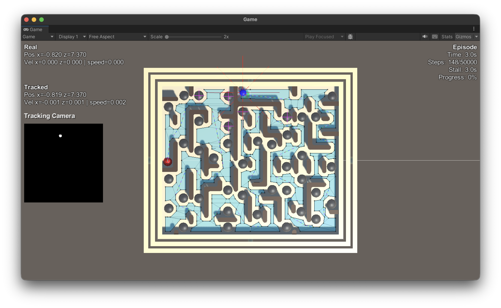
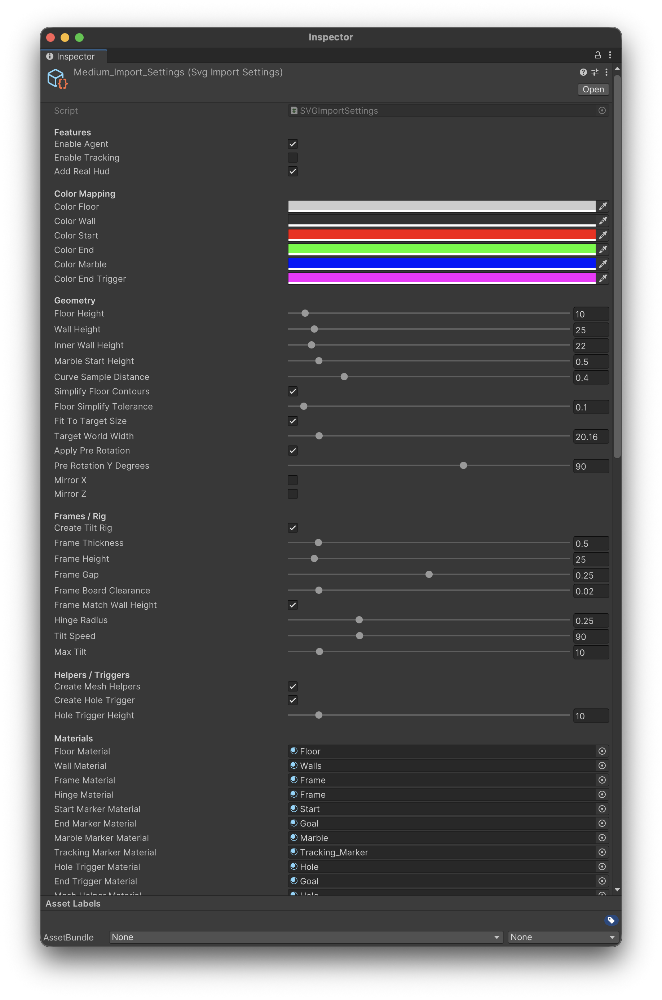
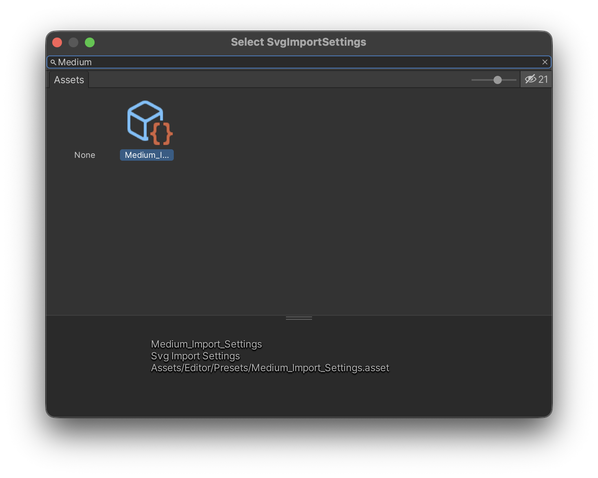
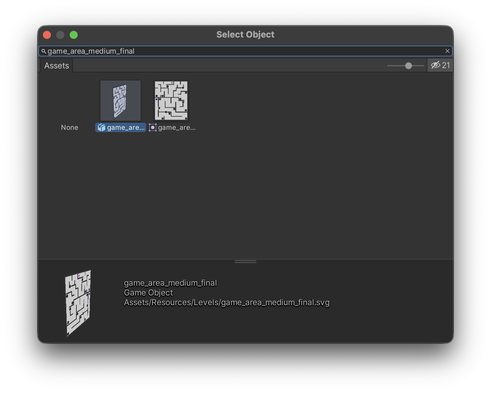
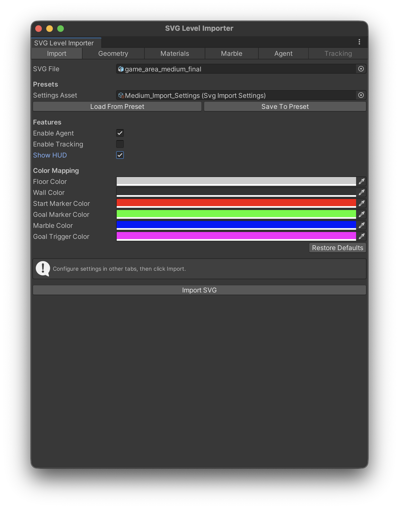
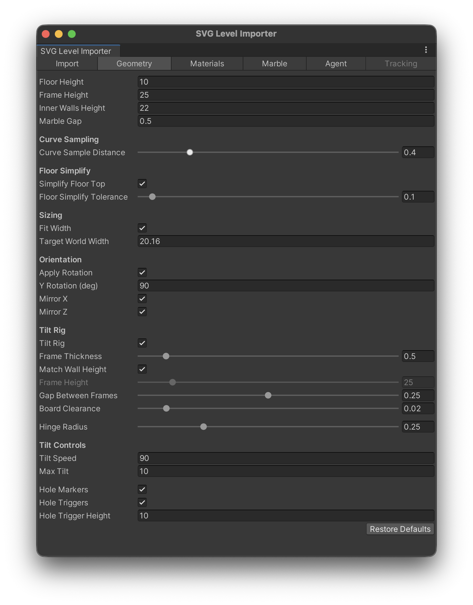
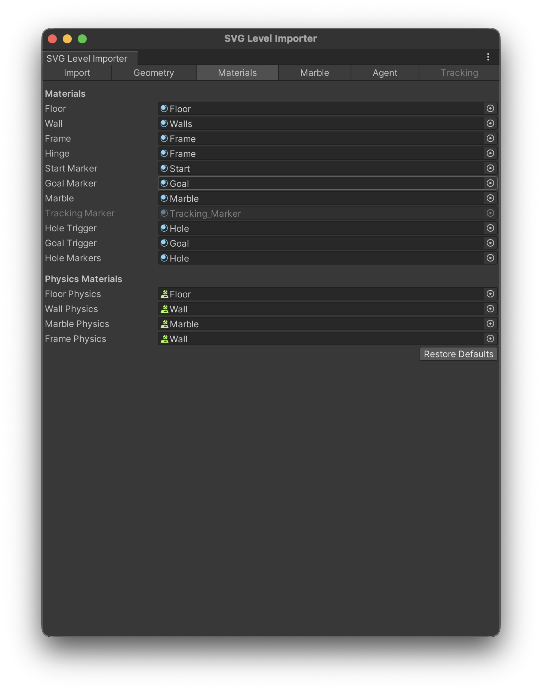
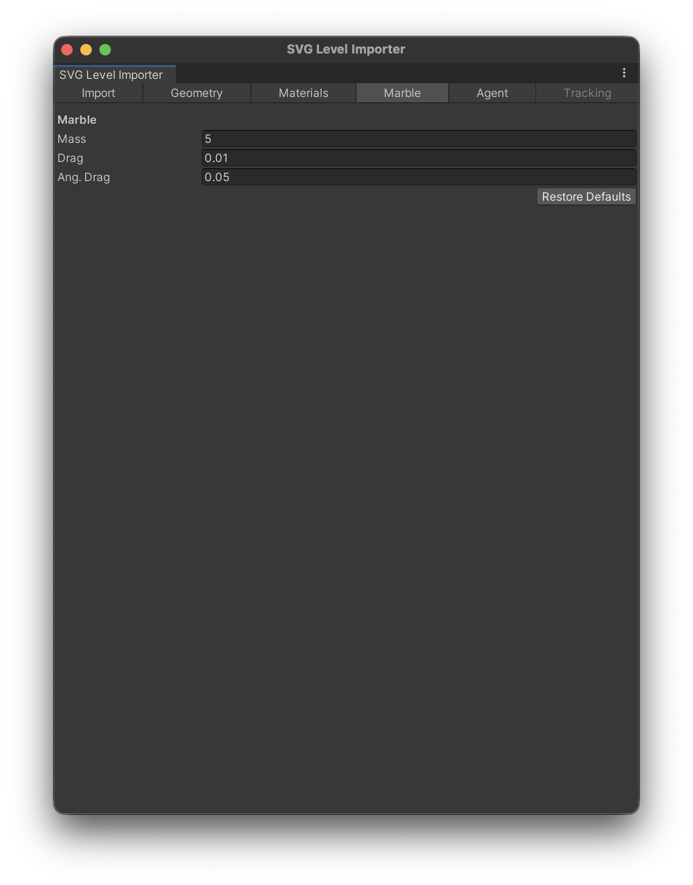
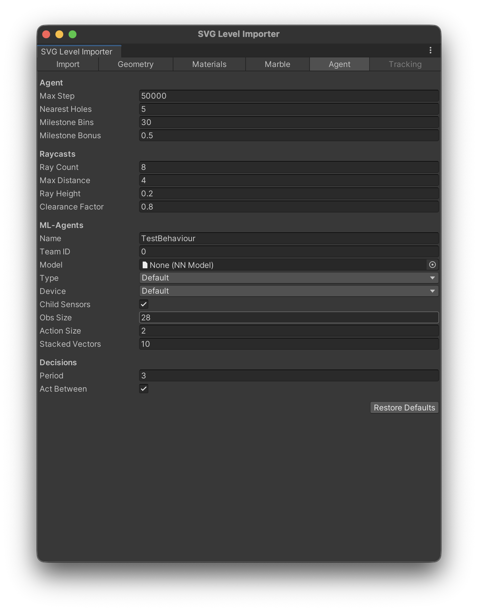
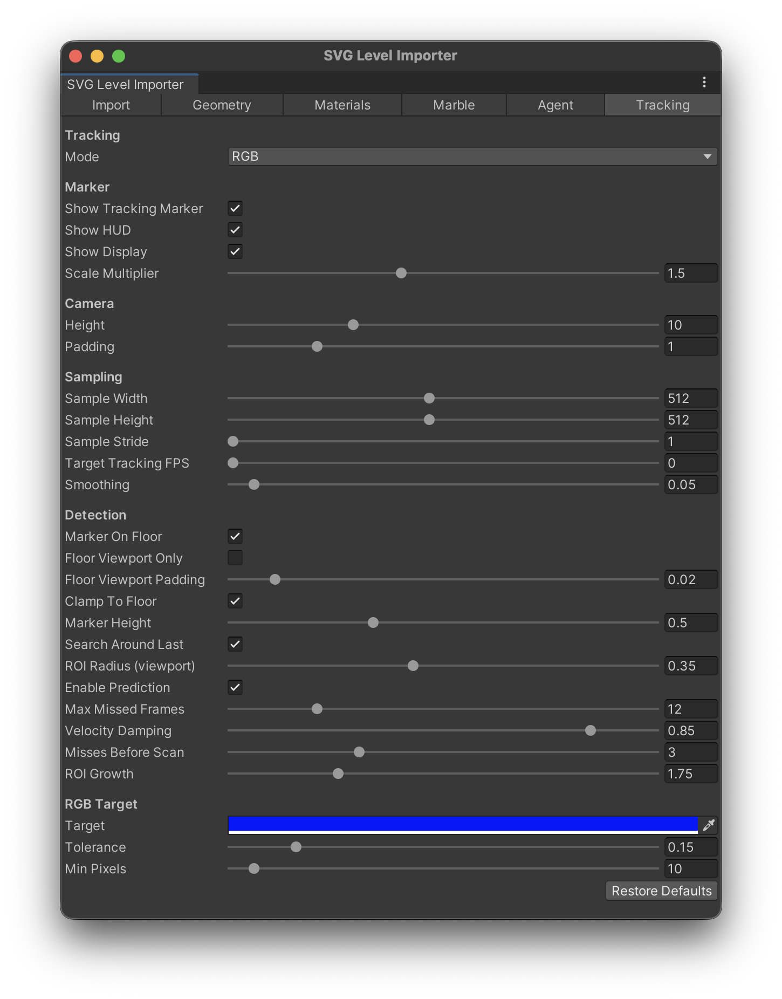

# Marble Maze (Unity + ML-Agents)

WebGL/desktop-ready Unity project that teaches a virtual marble to navigate a tilt-based maze using reinforcement learning with Unity ML-Agents. Includes manual play, multiple difficulty scenes, and built-in HUD/debug utilities.

## Overview

The agent tilts a board to roll a marble from a random start to a goal while avoiding holes and obstacles. Learning happens via PPO (or similar RL algorithms) through the ML-Agents toolkit. Observations combine goal/marble positions, board tilt, nearest hole locations, a guidance vector along a NavMesh path, progress along that path, and radial obstacle raycasts. Two continuous actions control tilt in X and Z.

## Features

- Multiple difficulties: `Easy`, `Medium`, `Hard`, `Extreme` in `Assets/Scenes/`
- Manual play via keyboard and automatic control via ML-Agents
- Clean separation of tilt control (`TiltController`), rigging (`GimbalRig`), and agent logic (`BoardAgent`)
- Progress-aware rewards with milestone bonuses and stall timeout handling
- On-screen HUDs for episode stats and object tracking
- NavMesh-based path guidance and debug visualization

## Tech Stack

- Unity Editor: 2022.3.9f1 (LTS)
- Unity packages (selected):
  - `com.unity.ml-agents`: 2.0.1
  - `com.unity.ai.navigation`: 1.1.7
  - `com.unity.textmeshpro`: 3.0.6
  - `com.unity.ugui`: 1.0.0

## Project Structure (selected)

- `Assets/Scenes/`
  - `Easy.unity`, `Medium.unity`, `Hard.unity`, `Extreme.unity`
- `Assets/Scripts/`
  - `BoardAgent.cs` — ML-Agents Agent (observations, actions, rewards, progress)
  - `TiltController.cs` — High-level tilt driver with keyboard/manual support
  - `GimbalRig.cs` — Cardanic rig applying clamped X/Z tilts
  - `GoalTrigger.cs` — Success detection and episode end
  - `HoleTrigger.cs` — Failure/reset handling
  - `EpisodeHUD.cs` — Episode time/steps/stall/progress HUD
  - `TrackingHUD.cs` — Position/velocity HUD for any transform
  - `PathPlanner.cs` — NavMesh path debug visualizer
  - `Util/BoundsUtils.cs` — Utility helpers
- `Assets/Models/` — Example `.onnx` models
- `Assets/ML-Agents/Timers/` — Performance/timing JSON outputs
- `ProjectSettings/ProjectVersion.txt` — Unity version

## Requirements

- Unity 2022.3.9f1 (LTS) or compatible 2022.3 LTS
- For training: Python 3.8–3.11 recommended by ML-Agents; install ML-Agents Python packages
  - It's important to match Python package versions to your Unity ML-Agents package. See the official release matrix. Example (adjust as needed):
    - `pip install mlagents mlagents-envs`

## Getting Started

1) Clone the repository

2) Open in Unity Hub with Unity 2022.3.9f1

3) Open a scene from `Assets/Scenes/` (start with `Easy.unity`)

4) Make sure NavMesh is baked (Window → AI → Navigation → Bake) if paths look incorrect

5) Press Play

## Level Setup (SVG Importer)

You can generate playable mazes from SVGs using the importer. We provide:

- Presets: `Assets/Editor/Presets/` → `Easy_Import_Settings.asset`, `Medium_Import_Settings.asset`, `Hard_Import_Settings 2.asset`, `Extreme_Import_Settings 1.asset`.
- Sample SVGs per complexity under `Assets/Resources/Levels/` (modifiable or replaceable).
- Default materials that you can extend or swap.

### Quick start

1) Open the SVG Level Importer window (search the menu for "SVG Level Importer").
2) In the `SVG File` field, select your SVG.
3) In `Settings Asset`, pick a preset for your target complexity (e.g., `Medium_Import_Settings.asset`).
4) Click `Load From Preset` to populate all tabs.
5) Optionally tweak tabs:
   - Import: enable Agent/Tracking/HUD; set color mapping to match your SVG.
   - Geometry: heights, curve sampling, simplify tolerance, fit-to-width, rotation/mirroring; tilt rig/frame sizes; tilt speed/max tilt; hole triggers.
   - Materials: assign floor/wall/frame/markers and physics materials. Defaults are shipped and can be extended.
   - Marble: mass/drag/ang. drag.
   - Agent: decision period, observation/action sizes, raycasts, nearest holes, milestone bins/bonus, behavior name/model/device.
   - Tracking: camera and sampling settings; RGB target color and tolerance if using marker tracking.
6) Click `Import SVG` to build the level (prefab/objects) into the scene.
7) Bake the NavMesh (Window → AI → Navigation → Bake) if guidance lines/path progress look off.
8) If you refined settings, click `Save To Preset` to persist them for reuse.

**Important**: The complexity presets populate runnable parameters across all tabs (Import, Geometry, Materials, Marble, Agent, Tracking), but they do not ship with or auto-assign a per-complexity inference model (`.onnx`). Use an example model under `Assets/Models/` or train your own (see "Training"), then assign it on the agent via `Behavior Parameters → Model` and set it to Inference Only.

Notes

- Exporting from Affinity (or similar): ensure "Flatten transforms" is enabled in the SVG export. This keeps geometry consistent for the importer.
- You can create presets via `Create/SVG Import Settings` and then reuse them across levels.
- Four sample scenes (`Easy`, `Medium`, `Hard`, `Extreme`) demonstrate different complexities and presets.

### Controls (Manual Play)

- Arrow keys or WASD: tilt the board
  - X tilt: Vertical axis (Up/Down)
  - Z tilt: Horizontal axis (Left/Right), inverted internally for natural feel
- The `EpisodeHUD` shows time, steps, stall countdown, and path completion

## Agent Details

- Actions: 2 continuous
  - `actions[0]` → tilt X
  - `actions[1]` → tilt Z
- Observations (vectorized):
  - marble position (2, normalized board-local)
  - goal position (2, normalized board-local)
  - current tilt X/Z (2, normalized by max tilt)
  - k nearest hole positions (2k, normalized board-local)
  - guidance vector to next NavMesh waypoint (3, board-local)
  - progress along path (1, 0..1)
  - radial obstacle raycasts (rayCount scalars, normalized distance)
- Rewards (high level):
  - small step penalty each frame (e.g., −0.005)
  - positive shaping for forward progress along the NavMesh path
  - milestone bonuses at progress fractions
  - success bonus at goal; small penalty on falling into the hole/catch
  - episode ends on success, fall, or stall timeout

Key tunables are exposed in `BoardAgent` and `TiltController` (e.g., `maxTilt`, `tiltSpeed`, `rayCount`, `kNearestHoles`, `stallTimeoutSeconds`).

## Training

1) Install Python and ML-Agents (match versions to Unity package):

```bash
python -m venv .venv && source .venv/bin/activate
pip install --upgrade pip
pip install mlagents mlagents-envs
```

2) Start training:

```bash
mlagents-learn path/to/ppo_config.yaml --run-id=marble-ppo-001
```

3) When prompted, press Play in the Unity Editor to connect. Increase Editor Time Scale for faster training.

4) After training, set the `Behavior Parameters` component on the agent to Inference Only and assign the exported `.onnx` model (you can keep models under `Assets/Models/`).

Notes

- The behavior name in your YAML must match the `Behavior Parameters → Behavior Name` on the `BoardAgent` object in the scene.
- If you change observation composition or action dimensions, update training configs accordingly.
## Evaluation and Metrics

The project logs stats via `Academy.Instance.StatsRecorder`, including:

- `achieved_checkpoints` — number of NavMesh checkpoints reached
- `path_completion_ratio` — fraction of path covered (0..1)
- `episode_success` — 1 on success episodes, else 0

Use TensorBoard to visualize summaries during training:

```bash
tensorboard --logdir results
```

## Screenshots


Gameplay view: marble, HUD, and board rig in action. Useful to verify materials, colliders, and NavMesh guidance.


Import tab: choose `SVG File`, pick a `Settings Asset` preset, then use `Load From Preset` to apply or `Save To Preset` to store changes. Toggle features and set color mapping.


Preset picker: select one of the shipped presets, e.g., `Medium_Import_Settings.asset` under `Assets/Editor/Presets/`.


SVG picker: choose the SVG for your maze (samples per complexity are included in the project).


Tabbed importer UI: configure Geometry (heights, sampling, fit/rotation), Materials, Marble physics, Agent (decisions, rays, milestones), and Tracking (camera/target). Click `Import SVG` to generate the level.


Geometry: floor/frame heights, curve sampling and simplify tolerance, fit width and orientation, tilt rig/frame clearances, tilt speed/max tilt, and hole triggers.


Materials: assign visual and physics materials for floor, walls, frame, markers (start/goal/marble/hole). Defaults are provided and can be extended.


Marble physics: mass, drag, and angular drag for the rolling behavior.


Agent: max steps, nearest holes, milestone settings; raycasts (count/distance/height/clearance); ML‑Agents behavior name/model/device, obs/action sizes, stacked vectors, and decision period.


Tracking: RGB/other modes, marker visibility, camera height/padding, sampling resolution/stride/FPS, prediction and ROI, and the RGB target color with tolerance.

## Troubleshooting

- Marble not moving: ensure `TiltController` is present and wired to `GimbalRig` (auto-wires by name `OuterFrame`/`InnerFrame`).
- No path or poor guidance: bake NavMesh for the scene; verify `NavMeshSurface` settings.
- Multiple boards in a scene: rebake the NavMesh with only the active board enabled/visible; hide or disable all other boards before baking to avoid contaminating the mesh.
- Falls never detected: confirm the catch volume has `HoleTrigger` and is a trigger collider; marble has a `Rigidbody`.
- Goal not registering: `GoalTrigger` must be on a trigger collider at the goal; agent reference is found via parent.
- Holes not observed: ensure hole objects are tagged `Hole`.
- Training doesn’t connect: check ML-Agents Python/Unity package versions; start `mlagents-learn` before pressing Play.
- RGB tracking not working: ensure the marble's material color matches the RGB target color configured in the Tracking tab.

## Acknowledgements

Assisted by Cursor and GitHub Copilot.

## License

Licensed under the MIT License. See `LICENSE` for details.
